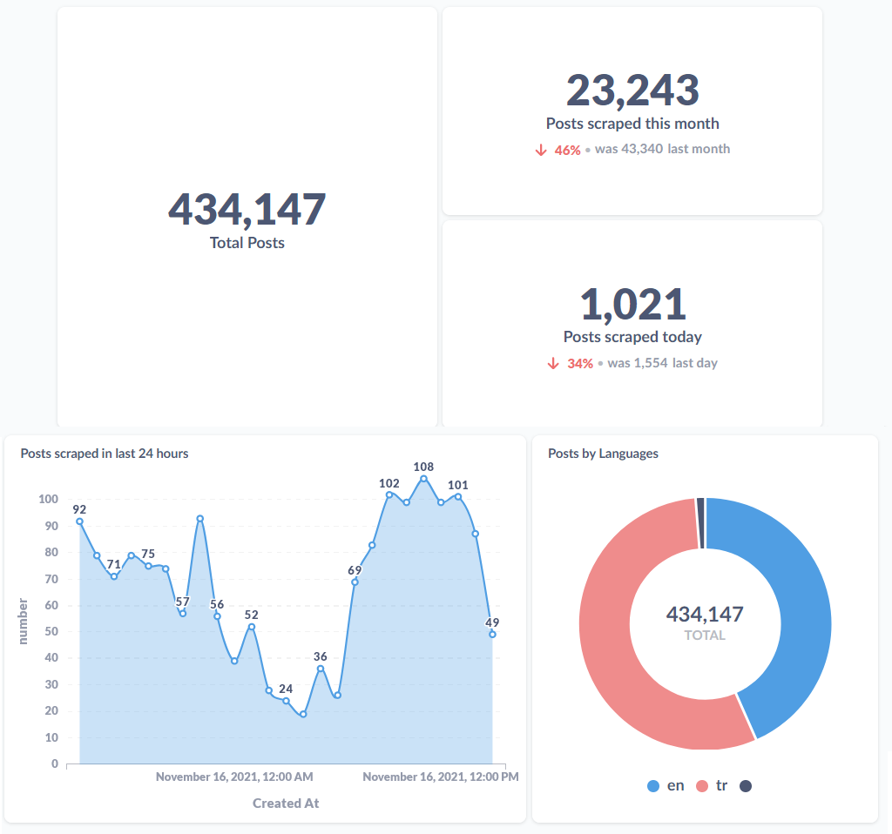
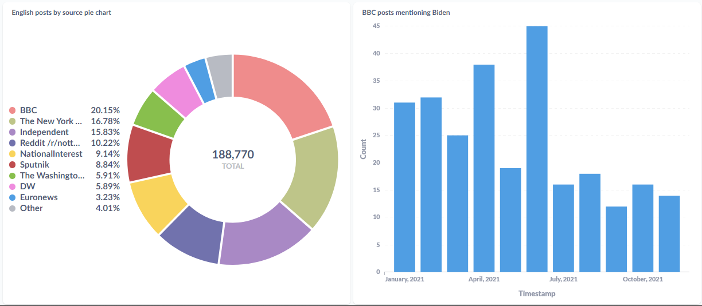

# mergen

Considerably fast news/social media scraper written in Go, using its concurrency features. Part of a project focused mainly on Data Mining using NLP. 

mergen can gather news data from RSS feeds, Twitter accounts (using the unofficial API), Subreddits, and Eksisozluk posts (a Turkish forum-like website). Utilizing PostgreSQL and Redis pub/sub channels (optional). 

Redis pub/sub is used for passing new posts to [bilge](https://github.com/humanova/bilge), my NLP analysis service. 

 
Sample visualizations of news scraped between January-November 2021, in my Metabase dashboard. 

## Configuration

### Sample main config (configs/config.json)
```json
{
  "ScrapeInterval" : 5,
  "DbName" : "posts",
  "DbHost" : "localhost",
  "DbPort" : 5432,
  "DbUser" : "user",
  "DbPassword" : "password",
  "DbSSLMode" : "disable",
  "RedisHost" : "localhost:6379",
  "RedisDB" : 0,
  "RedditConfigPath" : "configs/redditbot.agent",
  "RSSListPath" : "configs/rss_list.json",
  "RedditListPath" : "configs/reddit_list.json",
  "TwitterListPath" : "configs/twitter_list.json"
}
```

### RSS config (config/rss_list.json)
```json
{
  "websites" : [
    {
      "name": "The Washington Post",
      "lang": "en",
      "feeds" : [
        "http://feeds.washingtonpost.com/rss/rss_powerpost?itid=lk_inline_manual_4",
        "http://feeds.washingtonpost.com/rss/world?itid=lk_inline_manual_43"
      ]
    },
    {
      "name": "The New York Times",
      "lang": "en",
      "feeds" : [
        "https://rss.nytimes.com/services/xml/rss/nyt/HomePage.xml",
        "https://rss.nytimes.com/services/xml/rss/nyt/World.xml"
      ]
    }
  ]
}
```

### Twitter config (config/twitter_list.json)
```json
{
  "accounts" : [
    {
      "name": "jack",
      "lang": "en"
    },
    {
      "name": "someone",
      "lang": "tr"
    }
  ]
}
```

### Subreddit list config (config/reddit_list.json)
```json
{
  "subreddits" : [
    "/r/template1",
    "/r/template2"
  ]
}
```

### Reddit bot config (config/redditbot.agent)
```
user_agent: "Mergen"
client_id: "agent_client_id"
client_secret: "agent_client_secret"
username: "username"
password: "password"
```
